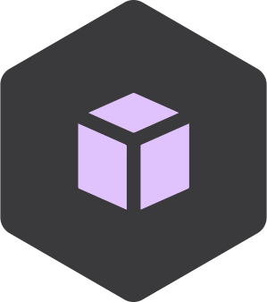

<!-- _class: cover split centered -->

<div class=ldiv>

# Nickel + Terraform = ❤️
Better Infrastructure Configuration for Less

</div>

<!--
Greetings, thank you for coming
Before starting, I like to think of this as an elaborate example of Yann's talk, right after this one
So, consider staying afterwards for more Nickel

What's Nickel anyway? A configuration language in development at Tweag
More about the specifics of it in due time

So, on the one hand this is a dogfooding project for Nickel
Use it for something concrete, generate issues and improve the language

On the other hand, I also want to explore a different paradigm for infrastructure as code

Most of you will be familiar with Terraform, but here's a quick overview anyway 
> go 2x
-->

---

### Terraform

* Provision infrastructure declaratively
* Document it just like code
* Review it just like code
* Version it just like code

<!--
Terraform's raison d'etre is specifying your infrastructure declaratively
Then have a tool (terraform) talk to your cloud APIs, figure out what needs to change, and then apply those changes

How does that work? They have their own configuration language, HCL. You specify resources in a format specific to your cloud provider.
E.g. I want the following VMs in the following subnets; some with a public IP, some behind a load balancer

But also: my GitHub organization has the following members, in the following teams, some of them are admins, some aren't

In any case, now you have a specification for your infrastructure written in code. So you can do code things with it.
> go

You can document it just like code. For instance, you don't need to have a separate place for a list of resources, or CLI commands to run when setting up a machine.
> go

You can review changes to your infrastructure just like code. Develop a change; show it to your coworkers or maybe just stare at it for a long time if it's your personal stuff. Try deploying it in a parallel test environment.
> go

And then you can version your changes just like code. Keep everything in git repository. Keep a history of your changes, so you can understand why something changed a year later. Develop changes in a branch. Maybe even bisect if you missed something on review and find out a month later.

So all of that sounds great, doesn't it?
> go
-->

---

### Sounds Great! But...
* Can you keep individual machines declarative?
* HCL vs. YAML vs. JSON vs. ...
* Can you move a deployment from one cloud to another?

<!--
But terraform doesn't really go far enough for my tastes. Even if I can specify many aspects of a machine or network of machines, it's pretty tricky to specify an entire machine configuration declaratively.
> go

I like to use NixOS for that; integrating it with Terraform can be a bit tricky. My far out hope for this project is to eventually make this integration seamless. But it's not there yet and I won't show an attempt at it here.

Let me just say that for something like that to work well, it would be really useful to configure the machines in the same language, in fact in the same place, as the network and supporting infrastructure they should live in. Speaking of language...
> go

Imagine you want a cluster of machines. So you set up a network and a bunch of VMs in Terraform with HCL.

And then you want your cluster to run Kubernetes. So you start diving into configuring K8s with YAML.

And then your actual app needs configuring in JSON.

Where's the actual source of truth in a setup like that? All those configurations are probably depend on each other.
> go

And now you need to switch your cloud provider for whatever reason. Suddenly you need new Terraform providers, and new resource configurations and so on.

So, as you can tell, I'm somewhat dissatisfied with this state of affairs. And I'm not looking for solutions specific to these problems; although I'd love to talk to you about ideas, I'm sure there's lots I could learn. I'm really looking for a generic way to tackle things like this. So what do I really want?
> go

-->

---

### I want
* Single source of truth
* Schemas that follow _my_ requirements
* Extensibility and Reusability

<!--
I want...
> go

a single source of truth. Write a configuration that can be used to generate all the specifics.
> go

I want that configuration to be structured in the way that makes the most sense for my application. It shouldn't be tied to a specific cloud API or specific orchestration tools.
> go

I want the configuration to be easily extensible and as reusable as possible. Of course there will always be tradeoffs there. But I want reusing and adapting a configuration to be as seamless as I can make it.

So, I've tried to explore this. My approach here focuses on using a single language for describing the source of truth. And what do I need from this language? Well, it needs to be powerful enough to express all the nonsense that I'm up to. And it should be powerful enough to describe the transformations for feeding the configuration into Terraform, K8s, whatever.

So I've given it away already, of course. I tried to use Nickel for that.
> go
-->

---

<!-- _class: enter-nickel -->

### [nickel-lang.org](https://nickel-lang.org)

<div class=ldiv>

```nickel
let AppSchema = {
    name | Str,
    version | SemanticVersion,
    description | Str,
} in
{
    name = "nickel",
    version = "1.0.0",
    description = "Our cool configuration language",
} | AppSchema
```

</div>

<div class="rdiv nickel-logo">  </div>

<!--
Nickel is being developed at Tweag. Our goal is to make a language that can be used to write complex configurations in a modular and correct way. And I hope I'll be able to show you an example of that.

So what is this Nickel language about?
> go 2x
-->

---

## Nickel
* JSON with functions
* and types
* but only when they help

<!--
Nickel is based on a JSON-like data model. And to ensure that it will be powerful enough to do anything you, well I, would want to do with it, we add functions.
> go

And to help keep me from shooting myself in the foot, we add types.
> go

But too many types can be annoying, so we spend a lot of time designing the language to get out of your way while keeping with the correctness goal.

So that was of course pretty useless as a first introduction. So let me try to give you a really quick crash course. At least you'll see the syntax before diving into my Terraform example.
> go

-->
---

### Crash Course on Nickel
```nickel
{
  field1 = "value",
  field2 = 5,
  interpolation = "%{field1} is %{string.from field2}",
  array = [ field1, field2, field3 ],
}
```

<!--
Records are surrounded by braces, like in JSON.
We use a JSON data model: strings, numbers, booleans in records and arrays
Keys don't need to be quoted, unless they happen to be keywords
We use = instead of :.
We have string interpolation using percents, and function calls `string.from`
Record fields can be recursively defined

But if recursive, what if change?
> go
-->

---

### Crash Course on Nickel
```nickel
{
  val = 5,
  plus-one = val + 1
}
```

<!--
plus-one depends on val,
maybe you want to build a new record with a changed val, but then plus-one should update too!
> go
-->

---

### Crash Course on Nickel
```nickel
{
  val = 5,
  plus-one = val + 1
} & {
  val = 7
}
```

<!--
Records can be merged with &
Recursively defined fields are updated automatically, so
> go
-->

---

### Crash Course on Nickel
```nickel
{
  val = 5,
  plus-one = val + 1
} & {
  val = 7
}

==> {
  val = 7,
  plus-one = 8
}
```

<!--
Of course, you can repeat those updates.
One of the core design goals of Nickel is to make this kind of "recursive overriding" as efficient as possible.

Idiomatic Nickel, if there is such a thing already, is expressing the final configuration as a recursively defined record
If you need to transform it for a specific consumer, make a new field that is a function of the relevant other fields

Writing configurations as recursive records is the key to modularity in Nickel, and Yann is going to tell you more about that paradigm. 

I also said I want to write correct configuration. Nickel helps with correctness in two ways. There's a static type system that I'm going to ignore right now. And there are custom data validation functions, to be applied to record fields. We call them contracts.
> go
-->

---

### Crash Course on Nickel
```nickel
let Contract = {
  name | Str,
  age | Num,
}
in {
  name = "Viktor",
  age = 31,
} | Contract
```

<!--
You can see a let binding; that's not specific to contracts, it just gives me a way to name an intermediate value

Contract here is a record contract. It specifies that whatever it is applied to, see the last line, must be a record, containing the fields name, a string, and age, a number.

Nickel checks that the record that Contract is applied to satisfies the record contract. And it does that no matter how often you recursively override fields.

You can also write more sophisticated contracts than Str or Num. You can make Nickel check pretty much any property on a value. For instance, you could make a contract specifying that a port is a number between 1 and 65535.

Or that a certain value for some field in a bunch of nested records only ever appears once; or that the values of another field are never duplicate; think specifying user ids declaratively.

In fact, you can do essentially arbitrary checks and transformations with contracts. But that takes us out of crash course territory.

Now I can finally start showing you my example. It's slightly contrived but bear with me please.
> go
-->

---

<!-- _class: split -->
<div class=ldiv>

#### Configuration

```nickel
{
  vkleen = {
    extra-teams = [ "nickel" ],
  },
  yannham = {
    is-admin = true,
    extra-teams = [ "nickel" ],
  },
} | {_: User}
```

</div>

<div class=rdiv>

#### Contract
```nickel
User = {
  is-admin
    | Bool
    | default = false,
  extra-teams
    | Array Str
    | default = [ ],
}
```

</div>

<!--
I want to build an imaginary github organization, starting out with two members.

So I make a User contract that specifies the data that I need to know for each user. In this case, I want to know if they should have admin privileges and which teams they should belong to. Also, just for fun, there should be an "all" team that always has all users as members.

That's what you see on the right. It's a record contract, specifying that each User needs to have an is-admin field, that's a Bool, and an array of team names they belong to. Both fields get default values, because I might be too lazy to type out all the fields.

Then on the left you see my configuration. It's a record whose fields are the users, and in the spirit of DRY I don't specify a user-name property but reuse the keys as the usernames.

For validation I apply a contract that says that the configuration is a record containing arbitrary fields, but each of them needs to satisfy the User contract.

So what do I need to do with this configuration?
> go
-->

---

### Making Terraform Understand
- For each user:
    - GitHub membership resource
    - Member property on all relevant team resources
- For each team:
    - Team resource
    - Team membership resource

<!--
Each user needs to get a membership resource and they need to be registered in the team membership resources for each relevant team.

Each team needs a team resource to actually declare it. And then each team needs a team membership resource to specify the members.

So, out of my custom data format, I need to extract all the users, all teams that are mentioned and then generate all these Terraform resource blocks.

It turns out, the logic to do that takes 60 lines of Nickel code, but I won't try to walk you through that here. I expect it's going to get even easier when we continue extending the Nickel standard library.

Now, I'm not counting a significant amount of contortions to make Terraform actually understand well. My excuse is that those are pretty much generic for all providers and I already have a tool to generate them. You could probably do without, if you don't want the genericity.

Because of those contortions, I've packaged the required tooling using nix. I imagine, some of you were here for Bryan's talk right before mine, you'll have a head start. Demo time!
> go
-->

---

### Demo!
🙏

---

### Summary
- Structure your configuration how _you_ want
- Enforce custom properties early
- Reuse with small changes using recursive overriding

<!--

-->

---

### Try it!
```
nix flake init -t github:tweag/tf-ncl/intro-docs
nix run .#terraform -- hello-tf.ncl init
nix run .#terraform -- hello-tf.ncl apply
```
And pester me with issues!
